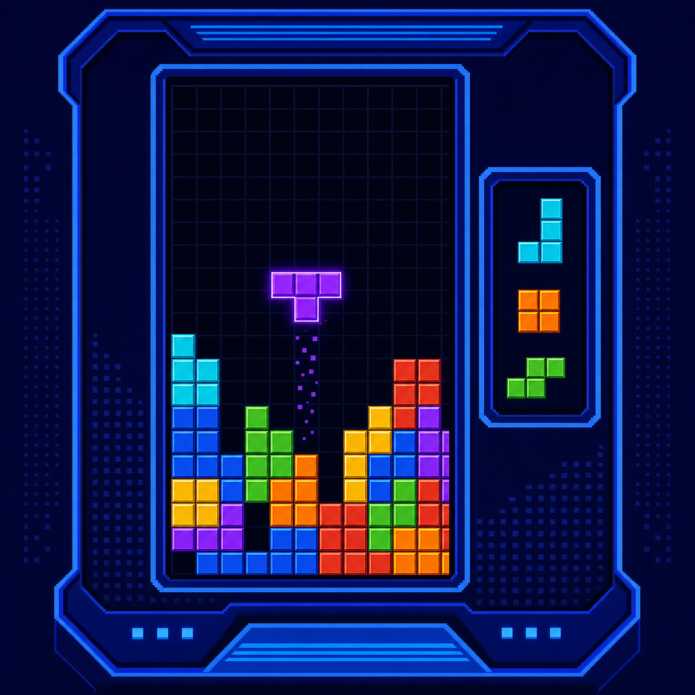
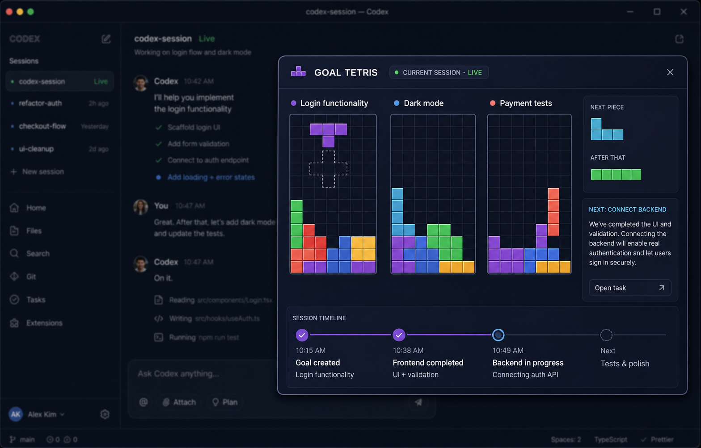

# Goal Tetris

Goal Tetris is a native Codex plugin for the OpenAI Build Week Developer Tools track. It turns each requested feature into its own Tetris map inside the Codex conversation. As Codex reaches meaningful milestones, the corresponding tetromino falls into place.





## Native Codex experience

The primary product surface is the embedded MCP UI resource `ui://goal-tetris/board.v10.html`: a classic blue arcade-style 10x20 Tetris panel with square cells, canonical I/J/L/O/S/T/Z tetromino colors, deterministic gravity-based placement, one-shot falling motion for active work, and a confirmation-gated completed line. The panel also bootstraps a fresh session snapshot when the host does not provide initial tool output, so the first open is populated instead of showing an empty shell. One Codex session can switch between multiple feature boards, while completed work moves to the previous-work tab. There is no pet and no browser window in the plugin experience.

The plugin flow is:

1. `goal_tetris_open` attaches the panel to the current Codex conversation.
2. `goal_tetris_start` creates one board for each requested feature.
3. `goal_tetris_update` locks a shape when a meaningful milestone changes.
4. `goal_tetris_snapshot` refreshes all boards.
5. When a board is complete, the developer presses `Confirm - Clear line`; the panel calls `goal_tetris_acknowledge` and removes the completed row.

## Command routing model

1. A developer instruction enters the current Codex session.
2. Codex decomposes the requested feature into an ordered set of meaningful milestones.
3. Each milestone maps to one canonical tetromino shape and enters the route queue.
4. When a milestone changes, its piece falls from the top of the 10x20 board, checks collisions, and locks at the lowest legal position.
5. When every milestone is complete, a full line appears and remains visible until the developer confirms it.

The board uses deterministic placement rather than random coordinates: it scores legal columns for holes, stack height, surface bumpiness, and the route's preferred column. This keeps the animation game-like while guaranteeing that the same session state renders the same locked layout. Acknowledging a completed line removes that row from the rendered board and records the action in shared state.

## What works

- Multiple feature boards in one native panel
- Right-side task picker for switching between boards in the same Codex session
- Separate current-work and previous-work tabs; completed boards move to history automatically
- Classic square tetrominoes with deterministic I/J/L/O/S/T/Z shapes and colors
- Gravity-based collision-aware placement; completed pieces remain locked and do not reflow when later milestones arrive
- A real NEXT route queue for the selected feature, with shape previews and milestone status
- A completed bottom line that stays visible until the developer confirms it
- Shared state bridge between the native panel and the MCP server
- Explicit Codex instructions for opening, creating, and updating boards
- English UI chrome by default; user-written Korean milestone titles and summaries are preserved verbatim
- Concise summaries, rationale, evidence, blockers, and next actions without exposing private chain-of-thought

## Codex connection boundary

The plugin can render a native panel and receive explicit updates from the current Codex conversation. Public plugin APIs do not provide a documented passive subscription to every private Codex session event, so the skill calls the bridge at meaningful milestones instead of pretending to observe undocumented internals. If Codex exposes a supported session-event stream in the future, the board model can consume it without changing the UI.

## How Codex and GPT-5.6 were used

Codex was used throughout the build to inspect the plugin host boundary, implement the MCP server and native panel, iterate on the arcade UI, test the state transitions, and review the final documentation. GPT-5.6 was used for the meaningful planning pass: decomposing feature requests into ordered milestones, choosing concise user-facing summaries, and reviewing the routing model for edge cases. The repository contains the implementation and tests so the behavior can be inspected rather than treated as a black box.

## Local fallback harness

The local dashboard is only for development and visual testing. It is not the main app surface.

```bash
npm start
```

Then open `http://localhost:4173`. The dashboard and installed plugin copy share `~/.goal-tetris/state.json`.

For a manual bridge while developing against an already-open Codex task, seed the shared state with its host-provided task ID:

```bash
node scripts/attach-session.mjs <codex-task-id> "Current Codex plugin integration"
```

This is only a development fallback. In a loaded plugin task, the `goal_tetris_open` tool performs the same attachment from inside Codex.

## Plugin files

- `.codex-plugin/plugin.json` - plugin manifest and Codex UI assets
- `.mcp.json` - local MCP server registration
- `mcp/server.mjs` - tools and native UI resource
- `mcp/widget.mjs` - embedded Codex panel HTML/CSS/JS
- `skills/goal-tetris/SKILL.md` - agent workflow
- `assets/goal-tetris-devpost-thumbnail.png` - no-mascot project thumbnail
- `assets/codex-app-popup-mockup.png` - visual concept for the native panel

## Language

The embedded panel uses English chrome by default for the Devpost build. User-written milestone titles and summaries remain unchanged, so Korean task wording is preserved. A future locale toggle can translate the chrome without changing board state.
